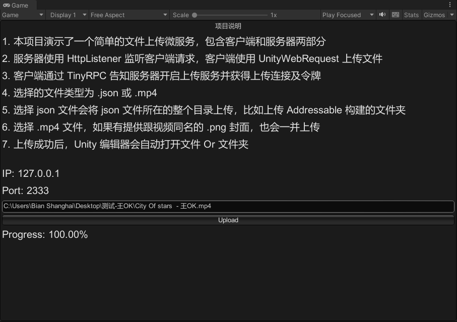

# Upload Service For Unity

> 这是一个为 Unity 提供文件上传服务的微服务，使用 HttpListener + UnityWebRequest + TinyRPC 实现了一个简单的文件上传演示。

## 示例特性
1. 演示了 [TinyRPC][3] 的使用方法
1. 演示了 UnityWebRequest 基于 [IMultipartFormSection][2] 实现多文件上传
1. 演示了 HttpListener 基于 Post 请求简单的授权校验及文件上传
1. 演示了 基于 [Http-Multipart-Data-Parser][1] 实现的较大文件的上传
1. 支持实时进度显示

## 示例流程

1. 启动 TinyRPC 客户端和服务端
2. 客户端向服务端发送文件上传请求
1. 服务端接收请求后告知客户端上传地址和令牌，并启动上传服务
1. 1 分钟内客户端通过 UnityWebRequest 上传文件，超时服务端上传服务自动关闭
1. 服务端接收文件后会存在指定的文件夹，同时保持原有文件结构

## Reference
1. [TinyRPC][3] - 一个极简、易懂的 RPC 网络通信框架
1. [UniWebServer][4] - 一个 Unity 中使用的简单的 web server
1. [HttpListener][5] - .NET 内置的 HTTP 服务库
1. [Http-Multipart-Data-Parser][1] - 一个用于解析 Multipart 数据的库
1. [UnityWebRequest][6] - Unity 内置的网络请求库

## Preview

## License
MIT

[1]:https://github.com/Http-Multipart-Data-Parser/Http-Multipart-Data-Parser
[2]:https://docs.unity3d.com/ScriptReference/Networking.IMultipartFormSection.html
[3]:https://github.com/bian-sh/TinyRPC
[4]:https://github.com/bian-sh/UniWebServer
[5]:https://docs.microsoft.com/en-us/dotnet/api/system.net.httplistener?view=net-5.0
[6]:https://docs.unity3d.com/ScriptReference/Networking.UnityWebRequest.html

